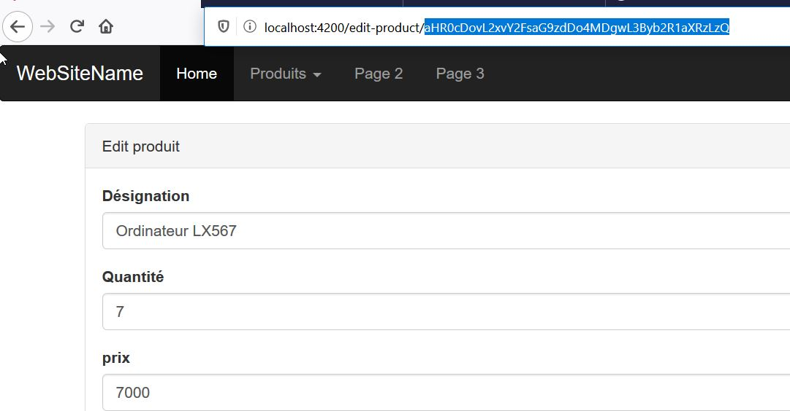
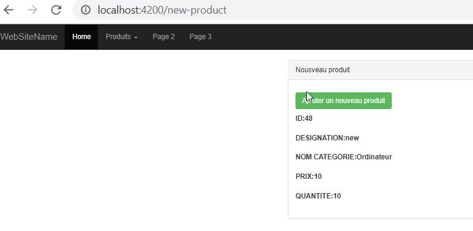
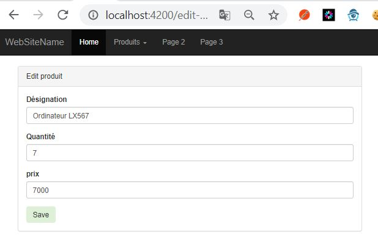
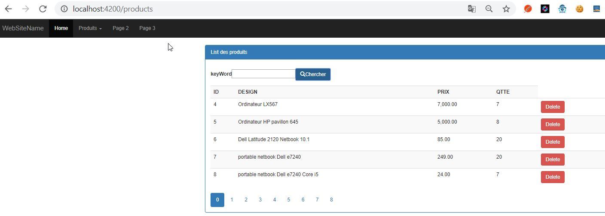
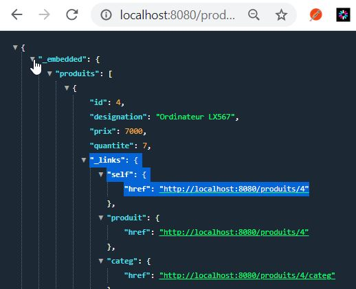
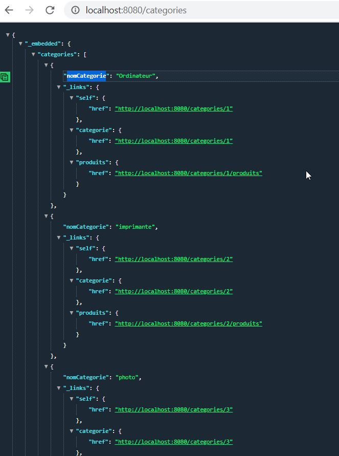

# 


````text
+------------------------------------------------------------------+
|                                             FrontEnd             |
|                  +--------------+                                |
|                  |EditProductComponent                           |           +------------------------------------------+
|                  |component     |                                |           |  +-------------------------+  BackEnd    |
|       +--------->+              +-----------------+              |           |  |                         |             |
|       |          |              |                 |              |           |  | +--------------------+  |             |
+---------+        +--------------+               +-+---------+    |           |  | | Spring rest Data   |  |             |
||      | |                                       |           |    |           |  | |                    |  |             |
||      + |        +--------------+               |CatalogueService|           |  | |                    |  |             |
||AppRoutingModule |NewProductComponent           |           |    |           |  | +--------------------+  |             |
||        |        |component     |               |service    |    |           |  |                         |             |
||module +--------->              +---------------+           +-------------------+ +--------------------+  |             |
||     +  |        +--------------+               |           |    |           |  | |                    |  |             |
+---------+                                       |           |    |           |  | |RestController      |  |             |
|      |           +--------------+               |           |    |           |  | |                    |  |             |
|      |           |              |               +-----+-----+    |           |  | +--------------------+  |             |
|      |           |ProduitsComponent                   |          |           |  |                         |             |
|      +---------->+component     +---------------------+          |           |  +-------------------------+             |
|                  |              |                                |           +------------------------------------------+
|                  +--------------+                                |                              |
|                                                                  |              +---------------+----------+
|                       +-----------------+                        |              |     mysql    DataBase    |
|                       |Entité ProductsModels                     |              |                          |
|                       |                 |                        |              |                          |
|                       |                 |                        |              |                          |
|                       |                 |                        |              +--------------------------+
|                       +-----------------+                        |
|                                                                  |
|                                                                  |
+------------------------------------------------------------------+

````

# angular 

## isntallation de composant
- ORM-JPA-Hibernate-Spring-data-Angular-JWT-FrontEnd>**npm install bootstrap@3 --save**
- ORM-JPA-Hibernate-Spring-data-Angular-JWT-FrontEnd>**npm install jquery  --save**
- ORM-JPA-Hibernate-Spring-data-Angular-JWT-FrontEnd>**ng g c produits**
- ORM-JPA-Hibernate-Spring-data-Angular-JWT-FrontEnd>**ng g c edit-prduct**
- ORM-JPA-Hibernate-Spring-data-Angular-JWT-FrontEnd>**ng g c new-product**
- ORM-JPA-Hibernate-Spring-data-Angular-JWT-FrontEnd>**ng generate module app-routing --flat --module=app**
- ORM-JPA-Hibernate-Spring-data-Angular-JWT-FrontEnd>**ng g s service/catalogue**


## url Encoding 

Dans le composant **ProduitsComponent** on n'envoi le **paramId** à la requete http en tant une chaine url encodée contenant directement le lien vers le backend à utlisé recupéré grace **_links.self.href**
```angular2
    this.url = produit._links.self.href;
    this.urlencode = btoa(this.url);
    console.log(this.url + ' ' + this.urlencode);
   this.myRoute.navigateByUrl('/edit-product/' + this.urlencode);
```

Puis on **decode** le **paramId** contenant le url vers le backend dans le composant **EditProductComponent**
````angular2
  // urldecode
    this.urlEncoded = this.activateRoute.snapshot.params['idparam'];
    this.urlDencoded = atob(this.urlEncoded);
    console.log(this.urlDencoded);

    // initialise le formulaire html d'edition
    this.catalogueSevice.getResource(this.urlDencoded)
````


le parametre encodé contient l'url complet vers le backend.  
 **'aHR0cDovL2xvY2FsaG9zdDo4MDgwL3Byb2R1aXRzLzQ='** fait reférence à **http://localhost:8080/produits/4**  




## Ajouter un produit


## Editer un produit


## Chercher un produit



# Backend
Ici on utilie spring rest data et restcontroller. Une fonctionalité particuliere à été developper via restcontroller car difficilement réalisable via spring rest data

## produit


## categorie


